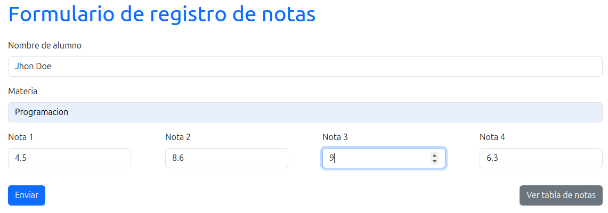
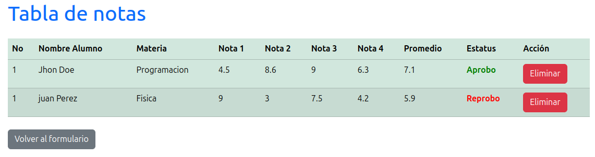
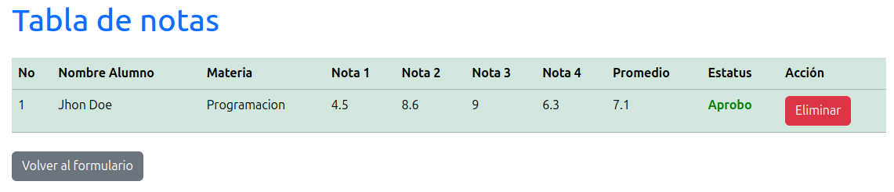

# Descripción del Repositorio
- Este repositorio contiene un pequeño proyecto de un formulario que permite insertar el nombre y apellido  de un alumno, una materia o asignatura y cuatro notas, al hacer click sobre el boton "enviar" almacena los datos en el localStorage del navegador y a su vez los muestra en una tabla donde se calcula automaticamente el promedio de las cuatro notas para saber si el alumno aprobo o reprobo la asignatura, finalmente contiene un boton para eliminar los datos tanto del localStorage, como de la interface visual del navegador.
- Para la realizacion de este proyecto se utilizaron las siguientes tecnologias:
  - [Html](https://developer.mozilla.org/es/docs/Web/HTML): Lenguaje de marcado para esrtuctura basica del proyecto en la web.
  - [Bootstrap](https://getbootstrap.com/): Framework multiplataforma de código abierto para diseño de sitios y aplicaciones web, basado en Html, Css y Javascript.
  - [Javascript](https://developer.mozilla.org/es/docs/Web/javascript): Lenguaje de programación para desarrollo de forntend y Backend.
  - [Typescript](https://www.typescriptlang.org/): Superset de javascript para desarrollo del Backend.
  - [NodeJs](https://nodejs.org/en): Entorno de ejecución de JavaScript multiplataforma, de código abierto y gratuito que permite crear servidores y aplicaciones web.

 ## Imagenes

